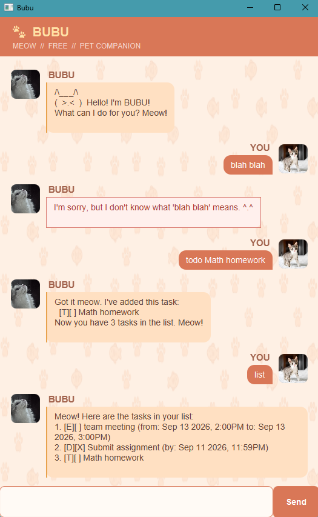

# Bubu User Guide

Bubu is a friendly pet-themed task manager. Type commands into the chat to
organise to-do tasks, deadlines, events, and reminders.

## Contents

- [Quick start](#quick-start)
- [Features](#features)
- [Saving your tasks](#saving-your-tasks)
- [Frequently asked questions (FAQ)](#frequently-asked-questions-faq)
- [Command summary](#command-summary)




## Quick start

1. Install **Java 25**
2. Run `java -version` in a terminal to check if Java is installed.
3. Download bubu.jar and place it in a folder where you want to store your tasks.
4. Open a terminal in its root folder.
5. Start Bubu:

   `java -jar bubu.jar`

6. Type `todo read a book` in the chat and press Enter or click **Send**.
7. Type `list` to see your tasks.
8. Type `bye` to close the application after Bubu displays its goodbye message.

## Features

### Information
- Replace placeholders such as `DESCRIPTION`, `DATE`, `START`, `END`, and `KEYWORD` with your own text.
- Use lowercase for commands. Bubu ignores extra spaces around command arguments.
- Enter command one at a time. Press Enter or click **Send** to submit.
- Enter dates in `yyyy-MM-dd` format and date-times in `yyyy-MM-dd HHmm` format. For example, `2026-09-18` and `2026-09-18 1800`.

### Add a To-do task : `todo`

Use `todo DESCRIPTION` to create a task without a date or time.

Example: `todo buy pet food`

### Add a Deadline task : `deadline`

Use `deadline DESCRIPTION /by DATE` to create a task with a deadline.

Examples:

- `deadline submit report /by 2026-09-18`
- `deadline submit report /by 2026-09-18 1800`

### Add an Event task : `event`

Use `event DESCRIPTION /from START /to END` to create a scheduled event.

Example: `event team meeting /from 2026-09-18 1000 /to 2026-09-18 1100`

The end time must be **later** than the start time.

### View your tasks : `list`

Shows all tasks in the order they were added. Each task is numbered starting from `1`.
Task numbers may change after a task is deleted, so check the latest list before
using `mark`, `unmark`, or `delete`.
Format: `list`

Example output:

```
Meow! Here are your tasks in your list:
1. [T][ ] buy pet food
2. [D][X] submit report (by: Sep 18 2026, 6:00PM)
3. [E][ ] team meeting (from: Sep 18 2026, 10:00AM to: Sep 18 2026, 11:00AM)
```
`[ ]` means incomplete and `[X]` means completed. `[T]`, `[D]`, and `[E]` indicate To-do, Deadline, and Event tasks respectively.
Dates displayed in the list are formatted as `Month day year, hour:minuteAM/PM`.
For example: `Sep 18 2026, 6:00PM`.

Example task-management flow:

```text
todo buy pet food
mark 1
unmark 1
delete 1
```

### Find tasks : `find`

Search for tasks containing a specific keyword in their description.

Format: `find KEYWORD`

Example: `find pet` will return all tasks with the word "pet" in their description.

### Mark a task as completed : `mark`

Mark a specific task in the list as completed.

Format: `mark NUMBER`

Example: `mark 1` will mark the first task in the list as completed.

### Mark a task as incomplete : `unmark`

Mark a completed task back to incomplete.

Format: `unmark NUMBER`

Example: `unmark 1` will mark the first task in the list as incomplete.

### Delete a task : `delete`

Remove a task from your task list. Double check before you remove your task as this action cannot be undone.

Format: `delete NUMBER`

Example: `delete 1` will remove the first task from the list.

### View upcoming reminders : `remind`

Remind you about upcoming incomplete deadlines and events due within the next three days.

Example: `remind`

Example output:

```
Meow! Here is an incomplete task due within the next 3 days:
1. [D][ ] submit report (by: Sep 18 2026, 6:00PM)
2. [E][ ] team meeting (from: Sep 18 2026, 10:00AM to: Sep 18 2026, 11:00AM)
```
If no tasks are due within the next three days, Bubu will display a message indicating that there are no upcoming reminders.

### Exit the application : `bye`

Say goodbye to Bubu and close the application. Bubu will display a farewell message and close the window after three seconds.

Example: `bye`

### Error handling examples

Bubu displays an error message when a command cannot be completed. The
application remains open so you can correct the input and try again.

| Input | Bubu's response |
| --- | --- |
| `he is` | `I'm sorry, but I don't know what 'he is' means. ^.^` |
| `todo` | `Meow! The description of a todo task cannot be empty.` |
| `mark 8` when there are 3 tasks | `Meow! The index you provided is invalid. Please provide a valid index between 1 and 3.` |
| `deadline submit report /by 18/09/2026` | `Meow! Please use yyyy-MM-dd or yyyy-MM-dd HHmm (e.g., 2026-08-31 1800).` |

Error responses are highlighted differently in the GUI so that they are easy
to notice.

## Saving your tasks

Bubu stores tasks in `data/bubu.txt`. The file is created when tasks are saved.
If the file is missing, Bubu starts with an empty task list. If the file contains
invalid data, Bubu shows a warning and starts safely without crashing.

## Frequently asked questions (FAQ)

### Bubu does not understand my command

Check the command spelling and refer to the [Command summary](#command-summary).
Bubu also accepts extra spaces around command arguments, but required arguments
must still be provided. Invalid commands produce an error message without
crashing the application, so you can correct the command and try again.

### A date is rejected

Use `yyyy-MM-dd` for dates and `yyyy-MM-dd HHmm` for date-times. Make sure the
date exists and, for events, that the end time is later than the start time.

### The application closes after using `bye`

This is expected. Bubu displays a goodbye message and closes the window after
three seconds.

## Command summary

| Command | Format | Purpose |
| --- | --- | --- |
| To-do | `todo DESCRIPTION` | Add a task without a schedule |
| Deadline | `deadline DESCRIPTION /by DATE` | Add a task with a deadline |
| Event | `event DESCRIPTION /from START /to END` | Add a scheduled event |
| List | `list` | Show all tasks |
| Find | `find KEYWORD` | Search for tasks |
| Mark | `mark NUMBER` | Mark a task as complete |
| Unmark | `unmark NUMBER` | Mark a task as incomplete |
| Delete | `delete NUMBER` | Delete a task |
| Remind | `remind` | Show upcoming incomplete tasks |
| Bye | `bye` | Display a farewell message and close Bubu |
